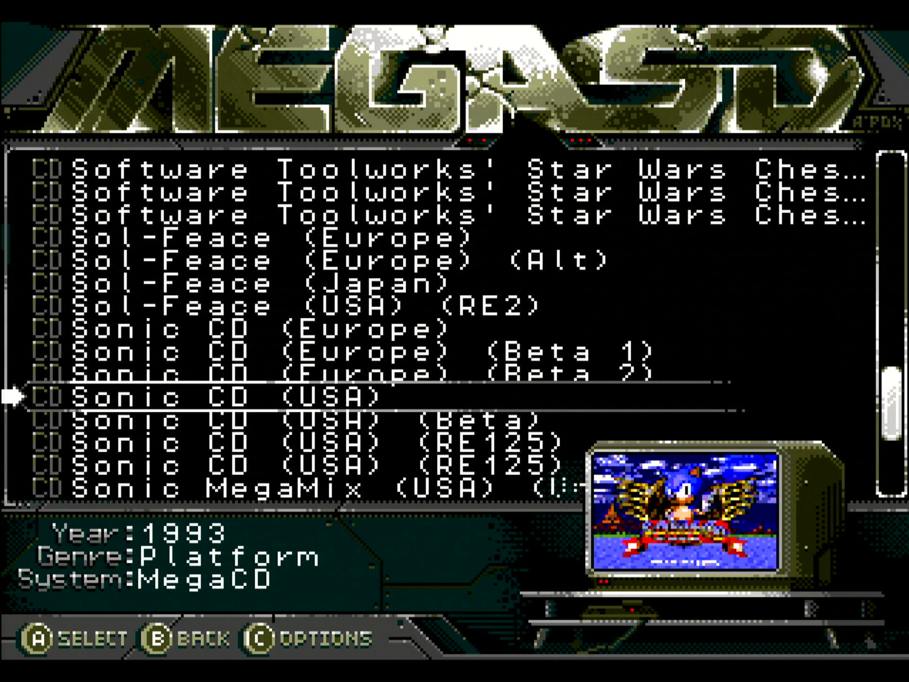

# MegaSD DB Generator

Python 3 scripts to create a DB for [Terraonion's GameDB Manager](https://github.com/Terraonion-dev/GameDBManagerMD) for the MegaSD. Downloads info from [IGDB](https://www.igdb.com/discover)

### [User Guide](https://github.com/hugo19941994/megasd-db-generator/wiki/User-Guide)



## Thumbnails

Most original thumbnails come from the [libretro-thumbnails](https://github.com/libretro-thumbnails/libretro-thumbnails) project (they can also be downloaded from the [libretro website](http://thumbnailpacks.libretro.com/)). Some others have been sourced from [Hidden Palace](https://hiddenpalace.org/). They have been resized and their color palette reduced to work with the MegaSD menu.

## How to run

```bash
# Install dependencies
pipenv install

# Set the Twitch Client ID & Client Secret
export TWITCH_CLIENT_ID=24c375d1-4f24-46b5-8ecf-d53b8c8f3919
export TWITCH_CLIENT_SECRET=850eeb9f-555f-4ebc-b3d8-76accb7b6238

# Download DATs from No-Intro
./generator/main.py --download-dats

# Download DAT from Redump and regenerate the MegaSD's custom Sega CD DAT
# The source file can either be a local folder with ROMs as ZIP files or
# an HTTP endpoint
# This step can usually be omitted, as the repo should have an up-to-date DAT file
./generator/main.py --update-custom-dat FOLDER-WITH-ROMS

# Downloads info from IGDB
./generator/main.py --download-db

# Generate the final DB in a zip file
./generator/main.py --generate-xml

# Or all stages at the same time
# ./generator/main.py --download-dats --download-db --generate-xml
```

The generated `.zip` file contains the thumbnails, the XML database, and a list of fuzzy matched ROMs. Our CI pipeline will automatically generate new [releases](https://github.com/hugo19941994/megasd-db-generator/releases) as needed.

## Missing info

**The DB is a work-in-progress**. It might never be 100% complete.

If you want to contribute any missing info I encourage you to add the info in [IGDB](https://www.igdb.com/discover) and the CI pipeline should automatically integrate those changes.

For any missing images first check the [libretro](https://github.com/libretro-thumbnails/libretro-thumbnails) repo. If the image is missing upload a PR there and open an issue here mentioning the screenshot. After the image is resized and its palette optimized it will be merged.

